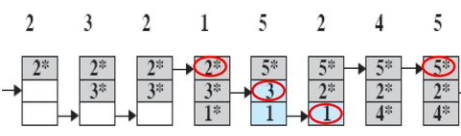
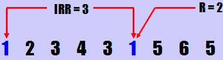
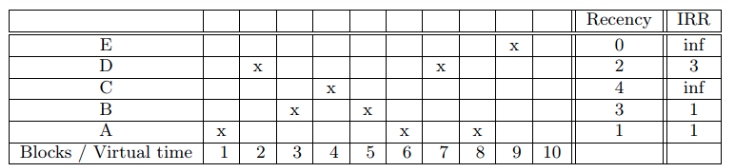

# 几种缓存替换策略的解析

## 1. CLOCK

​	Clock算法，可以理解成是一种最近未使用算法，他增加了引用位：

- 一个页面首次装入内存时，引用位置1。
- 需要替换页面时，替换引用位为0的页面，如果引用位置全部为1，则全部清0。

下面是具体实例：

Clock算法主要有这么几个特点：

- 随着对象的插入，指针也会移动。
- 访问命中时直接返回。

解释一下上图的操作：

- 针对第五个访问，由于页面发生缺少，且缓存中的页面引用位全部是1，因此全部清0并替换指针指向的页面。
- 灰色代表引用1，蓝色代表0。

## 2. CLOCK改进版

​	改进版的Clock算法，增加了一个标记位，表示是否被修改过。其它不详细介绍。

## 3. LIRS

​	LIRS使用**IRR(Inter-Reference Recency)**来表示记录数据块访问历史信息，IRR表示最近连续访问同一个数据块之间访问其它不同数据块非重复个数。

我们可以发现，LIRS使用了两个factors来管理页面的置换，而不是只考虑recency。

基于此，LIRS会动态维护两个集合：

- **LIR**：具有较小IRR的数据块集合，较低的IRR说明访问频率高，因此这些数据是热数据。
- **HIR**：具有较高IRR的数据块集合。注意，在HIR集合中的部分数据块不在缓存中，但记录了他们的历史信息并标记为未驻留在缓存中，这部分数据块被称为**nonresident-HIR**，相对应的，那些驻留在缓存中的数据块称为**resident-HIR**。

当然，LIR集合的大小是受限的，假设我们用L来表示驻留在缓存中的数据块总数，Llirs表示LIR集合大小，Lhirs表示驻留在内存中的数据块（resident-HIR）大小，那么，等式恒成立：
$$
L = Llirs + Lhirs
$$
LIRS需要尽可能地保护LIR中的数据块不被替换掉，因此当发生缓存块淘汰时，只会淘汰HIR集合中的数据块。但是，LIR和HIR如何切换呢？根据IRR来切换。

看上图，表中字母标志 `X` 表示数据块在某个时间点被访问, 比如数据块 A 分别在时间点 1、6 和 8 被访问，在时间点 10 数据块 {A, B, C, D, E} 的 recency 和 IRR 分别为:

- recency = {1, 3, 2, 4, 0}
- IRR = {1, 1, inf, 3, inf}

如果我们的L为3，Llir为2，Lhirs为1，那么：

- LIR = {A, B}
- HIR = {C, D, E}
- Resident-HIR = {E}
- Nonresident-HIR = {C, D}

当命中在LIR时，不需要修改LIR集合；当命中在HIR时，会更新这个数据块的IRR，这个 IRR 等于这个数据块当前的 recency，使用这个新的 IRR 与 LIR 集合中数据块中最大的 recency 进行比较，如果小于的话那么就交换这个HIR数据块和LIR中recency最大的数据块状态，进行冷热切换，详情请见[LIRS原理与实现](https://blog.csdn.net/z69183787/article/details/105534151/)。

对于置换，LIRS算法首先替换IRR最大的页面，其中infinite的值最大，当IRR相同时，替换Recency最大的页面。IRR在一定程度上反应了页面的访问频度，LIRS倾向于认为：一个页面的IRR越大，将来的IRR会变得更大。Recency参数相当于LRU，替换时IRR优先于Recency，这就降低了最后一次访问数据的优先级，因为有些数据虽然最近访问却不一定常用，可能访问过一次之后很久都不再使用，如果Recency优于IRR，这些只使用了一次数据有可能会停留相当长时间。

## 4. CLOCK-PRO

​	Clock-pro算法实际上是LIRS思想在Clock算法上的体现。

